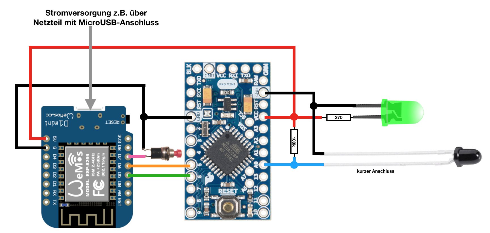
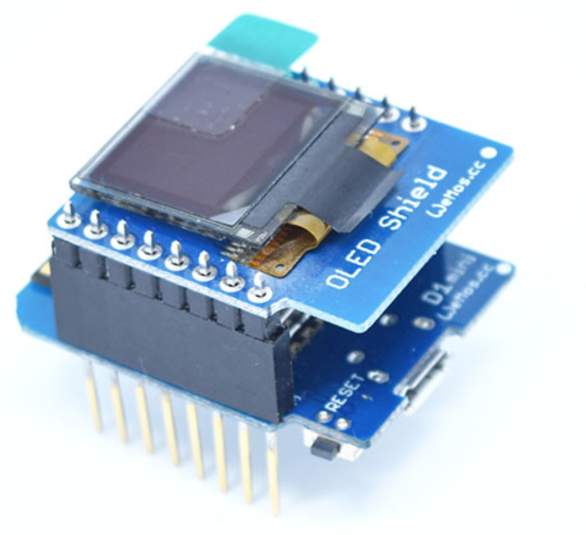
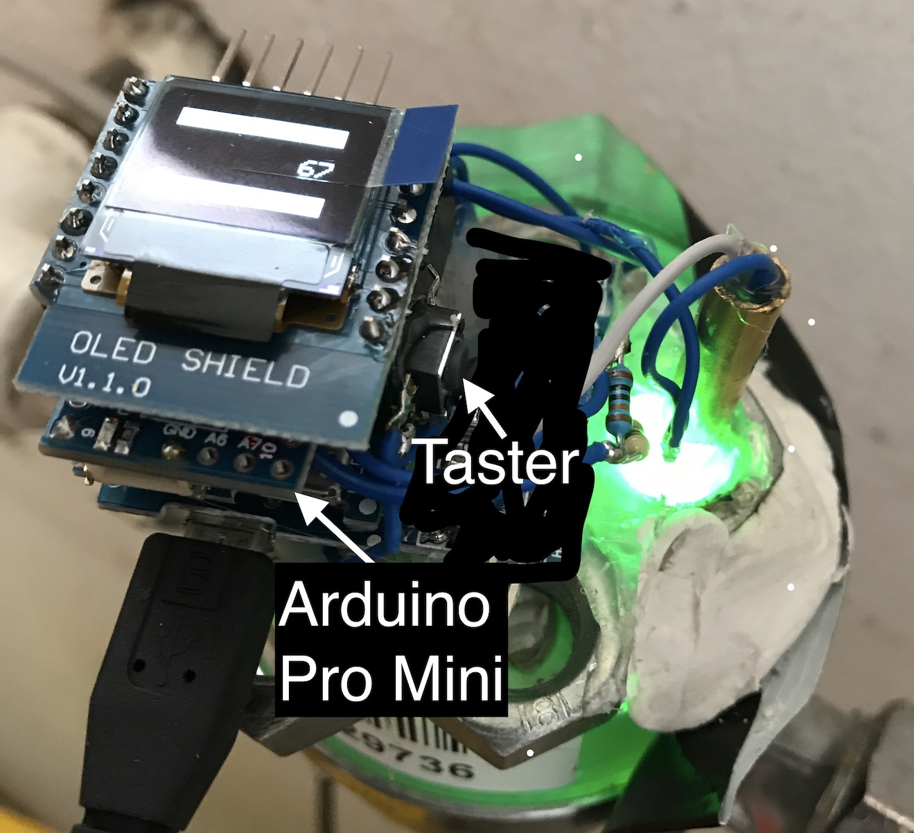

# Erfassung des Wasserverbrauchs in HomeMatic

Angelehnt an das Projekt auf [stall.biz](https://www.stall.biz/project/impulsgeber-fuer-den-wasserzaehler-selbst-gebaut) geht
es hier um die Integration eines solchen Impulsgebers in HomeMatic. Folgt man dem Link, kann man sich Ideen holen, wie man die optische Erfassungseinheit - also die LED 
und den Phototransistor am besten an seinem Zähler positioniert.

Entgegen der Umsetzung auf stall.biz, verzichte ich auf den TCRT5000 als Impulsgeber, denn man kann an diesem keine Hysterese einstellen, so dass es bei meinen Versuchen immer wieder zu einem "Flapping" (Flattern) kam, wenn der 
Zeiger des Wasserzähles an der Stelle zum Stehen kam, als er gerade soweit den Phototransistor abgedunkelt hat, dass er immer wieder den TCRT5000 zum Schalten brachte.
Dadurch kam es zu ungewollten Impulsen und Zählvorgängen.

## Folgende Bauteile werden benötigt:
- Wemos D1 Mini
- Wemos D1 OLED Shield
- Arduino Pro Mini
  - +FTDI Adapter zum Programmieren des Arduino Pro Mini
- stabiles! 5V Netzteil
- 1 Taster
- 1 LED 3mm grün, klar, mit sehr hoher Helligkeit (je heller desto besser, ich verwende 12.000mcd)
- 1 Phototransistor SFH 309-5 (klar oder schwarz)
- 1 Widerstand 270Ohm
- 1 Widerstand 100kOhm

Auf dem OLED Display wird später die Anzahl der gezählten Impulse angezeigt.


Der aktuelle Zählwert wird im Flash des Wemos gespeichert, sodass auch nach einem Stromausfall der letzte Wert gespeichert bleibt.

## elektronischer Aufbau

#### Schaltplan


#### Das OLED-Display wird einfach "huckepack" mit dem Wemos D1 mini verbunden und verlötet.


#### Zusammengebaut (von unten nach oben): Wemos D1 mini - Arduino Pro Mini - OLED Display

## Der CODE
### Wasserzaehler_ESP8266
Beim Öffnen der ```Wasserzaehler_ESP8266.ino``` in der Arduino IDE werden automatisch die anderen Projektdateien mitgeladen.
Der Code kann kompiliert und ohne weitere benutzerdefinierten Anpassungen auf den Wemos D1 mini geflasht werden.

### Wasserzaehler_ATM328
Hier sind folgende Anpassungen zu machen:

  ```#define DEBUG                        false```
  
  serielle Debug-Meldungen ausgeben (115200 Baud)
  
  Sinnvoll, um die High/Low Schwellen bei der Positionierung der Abtasteinheit zu ermitteln
  
  ```#define TransmitDelaySeconds         15```
  
  Verzögerung, nach wie vielen Sekunden der Zählwert übertragen werden soll
  
  ```#define ReTransmitDelaySeconds       10```
  
  Alle wie viel Sekunden soll der Zählwert an den Wemos D1 erneut übertragen werden, wenn dieser nicht erreichbar sein sollte
  
  ```#define PulseDelayMilliSeconds       500```
  
  Mindestabstand in Millisekunden zwischen 2 Impulsen
  
  ```#define LDRHIGH                      540```
  
  Über diesem Wert wird ein "HIGH"-Level erkannt
  
  ```#define LDRLOW                       490```
  
  Unter diesem Wert wird ein "LOW"-Level erkannt
  
## Die CCU

Seitens der CCU ist lediglich eine Systemvariable vom Typ "Zahl" in der WebUI anzulegen.

Der Name der Variable ist dann im WifiManager einzutragen.

## Inbetriebnahme

Um den Konfigurationsmodus zu starten, muss der Wemos D1 mit gedrückt gehaltenem Taster gestartet werden.

Auf dem Handy oder Notebook sucht man nun nach neuen WLAN Netzen in der Umgebung. 

Es erscheint ein neues WLAN mit dem Namen "ESP-WZ-xx:xx:xx:xx:xx:xx"

Nachdem man sich mit diesem verbunden hat, öffnet sich automatisch das Konfigurationsportal.

Geschieht dies nicht nach ein paar Sekunden, ist im Browser die Seite http://192.168.4.1 aufzurufen.

**SSID**: WLAN aus der Liste auswählen, oder SSID manuell eingeben

**WLAN-Key**: WLAN Passwort

**IP der CCU2**: selbsterklärend

**Variablenname**: Name der Systemvariable, die in der WebUI der CCU angelegt wurde

